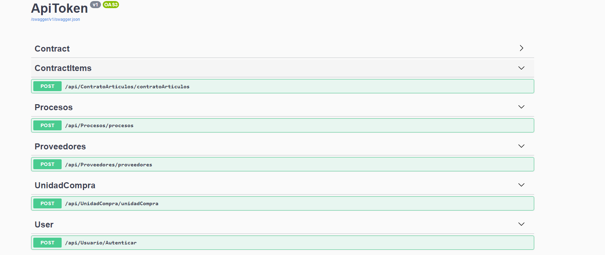
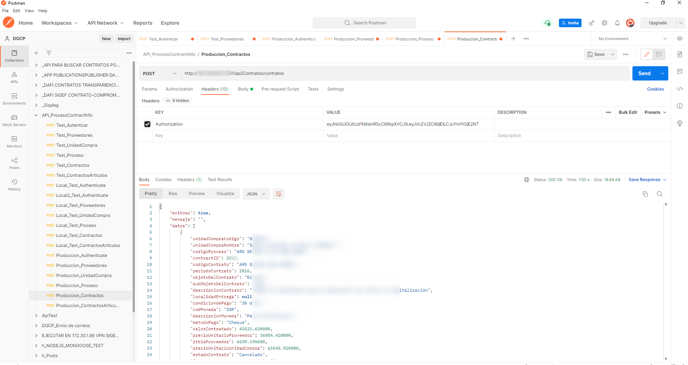

# Develop and maintain a Restful APIs service for external institutions

The objective is to develop and maintain a RESTful APIs service to provide information on suppliers, purchasing unit, contract processes, and contract articles to external institutions.

Technology used:
* IDE: **Visual Studio 2019 Community**
* App: **Web API / RESTful APIs**
* Standard file format: **JSON**
* Language: **C# / .NET Core 5**
* Database: **MS SQL SERVER 2016, T-SQL (views, store procedure)**

To carry out this task, I created a REST/RESTful APIs  web service project in .net core 5 in which I had the following Endpoints:

Purchase unit: in this endpoint you can obtain all the information such as name, address, etc., of the institutions of the Dominican state.

Providers: at this endpoint, you can obtain all the information such as name, address, RNC code, etc., of the registered providers of the Dominican state.

Processes: at this endpoint, you can obtain all the information about the purchases and sales of products between suppliers and government institutions.

Contracts: in this endpoint, you can obtain all the information about the contracts made for purchasing and selling products between suppliers and government institutions.

Articles of contracts: in this endpoint, you can obtain all the information about the articles of contracts made for the purchases and sales of products between suppliers and government institutions.

This API applies JSON Web Token (JWT) authentication
for customer requests. It also has pagination implemented with no more than 20 records per pagination.

To make requests use Swagger and Postman
For database connection use Linq.

##### Screenshots of the System

